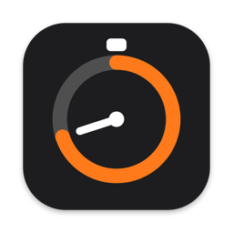

<p align="center"></p>

<h1 align="center">Time Bar</h1>

<p align="center">Menü çubuğunda geri sayım, kronometre, mesai saati ve pomodoro.</p>

<p align="center"><a href="https://github.com/omerfarukgzr/time-bar/releases/latest/download/TimeBar.zip"><b>⬇ Time Bar'ı indir (macOS)</b></a></p>

---

Bir ad yaz, süreyi seç, başlat. Sayaç menü çubuğunda ikonuyla birlikte görünür.

## Modlar

- **Geri sayım:** Süre dolunca bildirim ve ses gelir, menü çubuğu kırmızı yanıp söner. Bildirimden "+5 dk" diyebilirsin. Son dakikada süre turuncuya döner.
- **Kronometre:** Sıfırdan yukarı sayar, duraklatılabilir.
- **Mesai:** Satranç saati gibi çalışır. Çalışırken bir taraf, kalkınca diğer taraf işler. Kısayola ya da sağ tıka basınca çalışma ile mola arasında geçer. Mesai bitince özet çıkar: ne kadar çalıştın, ne kadar mola verdin, kaç mola, en uzun kesintisiz çalışma. Geçmiş mesailer Ayarlar › Geçmiş'te haftalık grafikle listelenir.
- **Pomodoro:** Odak ve mola aralıklarını sırayla sayar; belirli sayıda odaktan sonra uzun mola gelir. Süreler Ayarlar › Modlar'dan değişir.

Hangi modların panelde görüneceğini ve her birinin ayrıntılı ayarlarını Ayarlar › Modlar'dan seçersin.

## Kullanım

- **Sol tık:** Panel açılır. Yeni sayaç başlatılır, süren sayaç yönetilir.
- **Sağ tık:** Menü açmaz, o anki durumun tersine geçer. Mesaide çalışmadaysan molaya, moladaysan çalışmaya geçer; diğer modlarda duraklatır ya da devam ettirir. Sayaç yoksa en son başlattığını başlatır.
- **Kısayol:** Ayarlar'dan istediğin tuşu atarsın, sağ tıkla aynı işi yapar.

Süreler bitiş saatinden hesaplanır. Mac uykuya geçse ya da uygulama kapanıp açılsa da sayaç kaymaz, kaldığı yerden devam eder.

## Ayarlar

- Süreyi ve adı menü çubuğunda göster ya da gizle (sadece ikon kalır, ikondaki halka ilerlemeyi gösterir)
- Süre biçimi: `1:05:00` ya da `1 sa 5 dk`
- Bitiş sesi, Dock'ta göster, Mac açılınca başlat, güncellemeleri denetle

## Kurulum

1. **[TimeBar.zip](https://github.com/omerfarukgzr/time-bar/releases/latest/download/TimeBar.zip)** dosyasını indir ve aç.
2. `Time Bar.app` dosyasını **Uygulamalar** klasörüne sürükle.
3. Uygulamayı aç. Apple'a kayıtlı bir sertifikayla imzalanmadığı için macOS ilk açılışta uyarı verir:
   - **Sistem Ayarları › Gizlilik ve Güvenlik** bölümünde en alttaki **"Yine de Aç"** butonuna bas.
   - Ya da Terminal'de: `xattr -dr com.apple.quarantine "/Applications/Time Bar.app"`

## Güncelleme

Time Bar günde bir kez GitHub'daki son sürüme bakar. Yeni sürüm varsa panelin en üstünde **"Yeni sürüm var"** satırı ve ikonda küçük bir nokta görünür. **Güncelle**'ye basınca yeni sürüm indirilir, doğrulanır, eskisinin yerine kurulur ve uygulama yeniden açılır. Süren sayaç ve geçmiş korunur.

## Gizlilik

Veri toplamaz, analitik kullanmaz. Tek ağ isteği GitHub'daki sürüm kontrolüdür. Geçmiş sadece bu Mac'te saklanır.

## Derleme

```bash
scripts/build.sh            # dist/TimeBar.zip
scripts/build.sh --install  # ~/Applications'a kurar ve açar
```

macOS 14 veya üstü. Lisans: MIT.
