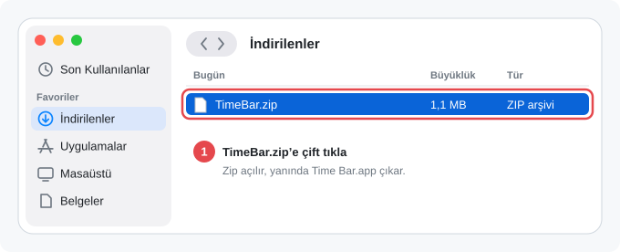
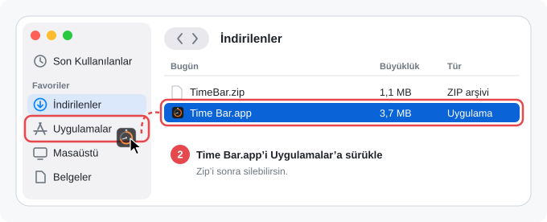
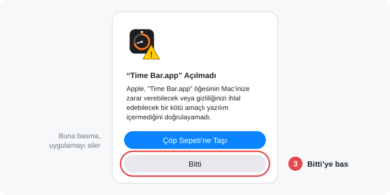
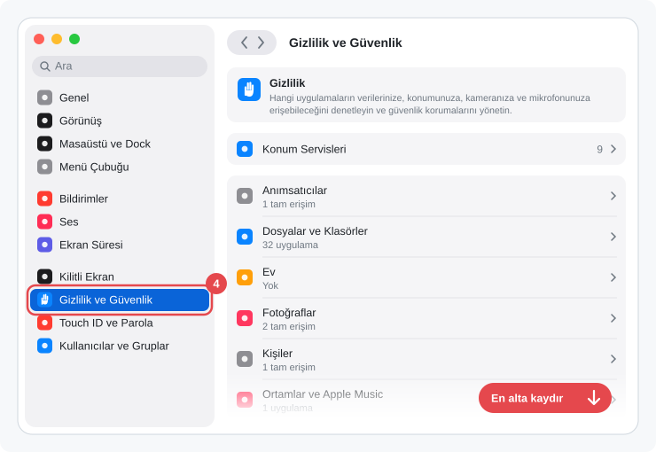
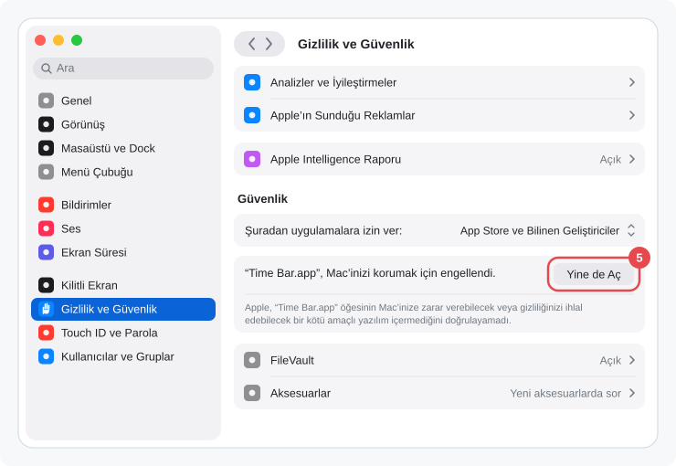

<p align="center"></p>

<h1 align="center">Time Bar</h1>

<p align="center">Geri sayım, kronometre, mesai saati ve pomodoro, hepsi menü çubuğunda.</p>

<p align="center">Kurmak için Terminal'e yapıştır:</p>

```bash
curl -fsSL https://raw.githubusercontent.com/omerfarukgzr/time-bar/main/install.sh | bash
```

---

Bir ad yaz, süreyi seç, başlat. Sayaç menü çubuğunda modun ikonuyla birlikte görünür. Sağ tık menü açmaz, o anki durumun tersine geçer: mesaideysen çalışma ile mola arasında, diğer modlarda duraklat ile devam et arasında. Böylece masadan kalkarken tek tıkla molaya geçersin, gün sonunda da 8 saati nasıl kullandığını görürsün.

## Özellikler

- **Geri sayım:** Süre dolunca bildirim ve ses gelir, menü çubuğu kırmızı yanıp söner. Son dakikada süre turuncuya döner. Bildirimden ya da panelden **+5 dk** ile uzatırsın.
- **Kronometre:** Sıfırdan yukarı sayar, duraklatılabilir.
- **Mesai:** Satranç saati gibi çalışır. Çalışırken bir taraf, molada diğer taraf işler. Menü çubuğunda çalışırken çanta, moladayken fincan görünür. Mesai bitince özet çıkar: ne kadar çalıştın, ne kadar mola verdin, kaç mola, en uzun kesintisiz çalışma.
- **Pomodoro:** Odak ve mola aralıklarını sırayla sayar, belirli sayıda odaktan sonra uzun mola verir. Sonraki aşama kendiliğinden başlayabilir ya da senin başlatmanı bekler.
- **Sağ tık ve kısayol:** Sağ tık o anki durumun tersine geçer. Sayaç yokken ikonu görünen modu başlatır. Ayarlar'dan istediğin tuşu kısayol olarak atarsın, sağ tıkla aynı işi yapar.
- **Geçmiş:** Ayarlar › Geçmiş'te haftalık grafik, haftanın özeti ve her mesainin molaları. Tek tıkla CSV olarak Excel'e aktarılır.
- **Modlar:** Hangi modların panelde görüneceğini ve her birinin ayrıntılı ayarlarını Ayarlar › Modlar'dan seçersin.
- **Menü çubuğu:** Süreyi ya da adı gizleyebilirsin, o zaman sadece modun ikonu kalır. Süre `1:05:00` ya da `1 sa 5 dk` biçiminde görünür.
- **Ekran kilidi:** İstersen Mac kilitlenince ya da uyuyunca mesai kendiliğinden molaya geçer, açınca çalışmaya döner.
- **Kaymaz:** Süreler bitiş saatinden hesaplanır. Mac uykuya geçse ya da uygulama kapanıp açılsa da sayaç kaldığı yerden devam eder.
- **Tek tıkla güncelleme:** Yeni sürüm çıkınca panelde görünür, **Güncelle**'ye basınca kendini günceller.
- Veri toplamaz, analitik kullanmaz.

## Gereksinimler

- macOS 14 veya üstü (Apple Silicon ve Intel)

## Kurulum

### Kolay yol: Terminal ile kurmak

**Terminal** uygulamasını aç (Spotlight'ta "Terminal" yaz), şu satırı yapıştırıp Enter'a bas:

```bash
curl -fsSL https://raw.githubusercontent.com/omerfarukgzr/time-bar/main/install.sh | bash
```

Komut son sürümü GitHub'dan indirir, SHA-256 özetini doğrular, Uygulamalar klasörüne kurar ve açar. macOS'un "doğrulanamadı" uyarısı çıkmaz. Aynı komut eski bir kurulumu da günceller. Ne yaptığını görmek istersen: [install.sh](install.sh)

### Terminal kullanmadan: zip ile kurmak

**1.** **[TimeBar.zip](https://github.com/omerfarukgzr/time-bar/releases/latest/download/TimeBar.zip)** dosyasını indir ve Finder'da **İndirilenler** klasörünü aç. Orada sadece `TimeBar.zip` vardır, ona çift tıkla. Safari kullanıyorsan zip kendiliğinden açılmış olabilir, o zaman 2. adıma geç.

<p align="center"></p>

**2.** Zip açılınca yanında `Time Bar.app` çıkar. Onu sol taraftaki **Uygulamalar**'ın üzerine sürükleyip bırak.

<p align="center"></p>

> Uygulamayı İndirilenler'den açma, mutlaka Uygulamalar'a taşı. Yoksa tek tıkla güncelleme çalışmaz. Repo sayfasındaki yeşil **Code › Download ZIP** butonu da uygulamayı değil kaynak kodu indirir, onu kullanma.

**3.** Uygulamalar klasöründe **Time Bar**'a çift tıkla. Uygulama Apple'a kayıtlı ücretli bir sertifikayla imzalanmadığı için macOS ilk açılışta bu uyarıyı gösterir. **Bitti**'ye bas. "Çöp Sepeti'ne Taşı"ya basma, uygulamayı siler.

<p align="center"></p>

**4.** Sol üstteki Apple menüsünden **Sistem Ayarları**'nı aç ve soldan **Gizlilik ve Güvenlik**'i seç.

<p align="center"></p>

**5.** Sağ tarafı en alta, **Güvenlik** başlığına kadar kaydır. "“Time Bar.app”, Mac'inizi korumak için engellendi." satırının yanındaki **Yine de Aç**'a bas.

<p align="center"></p>

**6.** macOS Mac parolanı ya da Touch ID'yi ister, onayla. Bir pencere daha çıkarsa orada da **Yine de Aç**'a bas.

Bunu sadece ilk kurulumda yaparsın. Sonraki güncellemeler panelden tek tıkla olur ve bu uyarı bir daha çıkmaz.

İki yolda da kurulum bitince menü çubuğunda Time Bar ikonu görünür.

## Kullanım

| Ne | Nasıl |
|---|---|
| Yeni sayaç | Menü çubuğundaki ikona **sol tıkla**, modu seç, ad ve süre gir, **Başlat**. |
| Hızlı başlat | Sayaç yokken ikona **sağ tıkla**. İkonu görünen mod, Ayarlar › Modlar'daki varsayılan süreyle başlar. |
| Molaya geç / çalışmaya dön | Mesaideyken **sağ tıkla** ya da kısayola bas. |
| Duraklat / devam et | Geri sayım, kronometre ve pomodoroda **sağ tıkla** ya da kısayola bas. |
| Bitir, +5 dk, aşamayı atla | Sol tıkla açılan panelden. |
| Ayarlar, Çık | Panelin altından. |

## Güncelleme

Time Bar günde bir kez GitHub'daki son sürüme bakar. Yeni sürüm varsa panelin en üstünde **"Yeni sürüm var"** satırı ve menü çubuğu ikonunda küçük bir nokta görünür. **Güncelle**'ye basınca yeni sürüm indirilir, SHA-256 özeti doğrulanır, eski uygulamanın yerine kurulur ve Time Bar yeniden açılır. Ayarların, süren sayacın ve geçmişin korunur.

Uygulama yerinde güncellenemezse (örneğin Downloads'tan açıldıysa ya da klasörüne yazılamıyorsa) ya da GitHub dosyanın özetini vermezse Releases sayfası açılır. O zaman kurulum komutunu tekrar çalıştırman yeterli, eskisinin yerine son sürümü kurar.

Güncelleme kontrolünü **Ayarlar › Hakkında › Güncellemeleri denetle** ile kapatabilirsin. Aynı yerden **Şimdi denetle** ile hemen bakabilirsin. Kontrol hiçbir veri göndermez, sadece GitHub'dan son sürüm numarasını okur.

## İzinler ve gizlilik

Time Bar **veri toplamaz.** Mikrofon, kamera, ekran kaydı, erişilebilirlik veya dosyalarına erişim istemez. Kısayol tuşu da erişilebilirlik izni olmadan çalışır. Kurulumda karşına çıkabilecek her şey şunlar:

| Ne | Ne zaman | Neden |
|---|---|---|
| "Tanınmayan geliştirici" uyarısı | İlk açılışta | Uygulama ücretli Apple sertifikasıyla imzalanmadı. Bir izin değil, bir kez "Yine de Aç" demen yeterli. |
| **Bildirimler** *(isteğe bağlı)* | İlk sayacı başlattığında | Süre dolunca, pomodoro aşaması değişince ve mesai hedefi dolunca haber vermek için. Vermezsen sadece ses çalar ve menü çubuğu yanıp söner. |
| Giriş öğesi bildirimi *(isteğe bağlı)* | "Mac açılınca başlat"ı açınca | macOS'un standart bildirimi. |

Verilerin sadece bu Mac'te durur:

- Ayarlar ve süren sayaç: `~/Library/Preferences/io.github.omerfarukgzr.timebar.plist`
- Mesai geçmişi: `~/Library/Application Support/Time Bar/history.json`

## Güvenlik

- Uygulama dışarıdan bağlantı kabul etmez ve yönetici yetkisi istemez.
- Tek ağ isteği, GitHub'dan son sürüm bilgisini okumaktır. İndirme sadece `github.com` üzerinden yapılır.
- Güncellemede indirilen dosyanın SHA-256 özeti GitHub'ın verdiği özetle karşılaştırılır. Özet yoksa ya da uyuşmazsa kurulmaz. Zip'ten çıkan uygulamanın kimliği ve sürümü de kontrol edilir; eski bir sürüme geri dönülmez.
- CSV'ye aktarırken `=`, `+`, `-`, `@` ile başlayan adlar düz yazı olarak kaydedilir, Excel onları formül olarak çalıştırmaz.
- Her sürümün `SHA-256` özeti Releases sayfasında yazar. İndirdiğin dosyayı doğrulamak için: `shasum -a 256 TimeBar.zip`
- Bir güvenlik sorunu bulursan lütfen [Issues](../../issues) üzerinden bildir.

## Nasıl çalışır

```
sol tık ──► panel ──► yeni sayaç / bitir / +5 dk
sağ tık ─┐
kısayol ─┴► durumun tersine geç ──► sayaç (aralıklar: başlangıç–bitiş saatleri)
                                          │
                     her saniye ──────────┴──► menü çubuğu: ikon + süre
```

- Sayaç saniye saniye azaltılmaz. Her çalışma, mola ya da odak aralığının başlangıç ve bitiş saati kaydedilir, süreler bunlardan hesaplanır. Bu yüzden Mac uyusa da uygulama kapansa da süre kaymaz.
- Mesaide çalışma ve mola ayrı aralıklar olarak tutulur. Mesai bitince bunlardan özet çıkarılır ve geçmişe yazılır. Birkaç saniyelik yanlış basışlar özete girmez.
- Kısayol, macOS'un `RegisterEventHotKey` özelliğiyle çalışır. Bu yüzden erişilebilirlik izni gerekmez.

## Kaynaktan derleme

Xcode 16 veya üstü gerekir.

```bash
git clone https://github.com/omerfarukgzr/time-bar.git
cd time-bar
scripts/build.sh            # dist/app.noindex/Time Bar.app ve dist/TimeBar.zip
scripts/build.sh --install  # ayrıca ~/Applications'a kurar ve başlatır
```

## Kaldırma

1. Mac açılınca başlatmayı açtıysan önce **Ayarlar › Genel › Mac açılınca başlat**'ı kapat.
2. Panelden **Çık**'a bas ve `Time Bar.app` dosyasını çöpe at.
3. İstersen ayarları ve geçmişi de sil:
   - `~/Library/Application Support/Time Bar`
   - Terminal'de: `defaults delete io.github.omerfarukgzr.timebar`

---

## English

**Time Bar** is a macOS menu bar timer with four modes: countdown, stopwatch, a chess-clock style **work shift** (one click toggles between work and break, and you get a summary of how you spent the day), and **pomodoro** with configurable focus/break lengths. Right-clicking the menu bar icon doesn't open a menu; it flips the current state (work ↔ break, pause ↔ resume) or starts the mode whose icon is shown. A custom global shortcut does the same. Settings include per-mode options, a weekly history chart with CSV export, and menu bar display options.

**Install:** run `curl -fsSL https://raw.githubusercontent.com/omerfarukgzr/time-bar/main/install.sh | bash`, or [download TimeBar.zip](https://github.com/omerfarukgzr/time-bar/releases/latest/download/TimeBar.zip) (always the latest release), move `Time Bar.app` to Applications, and open it (the app is not notarized: use *System Settings › Privacy & Security › Open Anyway*).

Updates: the app checks GitHub once a day and shows a "new version" row in the panel (can be turned off in Settings); one click downloads, verifies the SHA-256 digest and installs it, then relaunches. No data is collected. Requires macOS 14+. MIT licensed.
